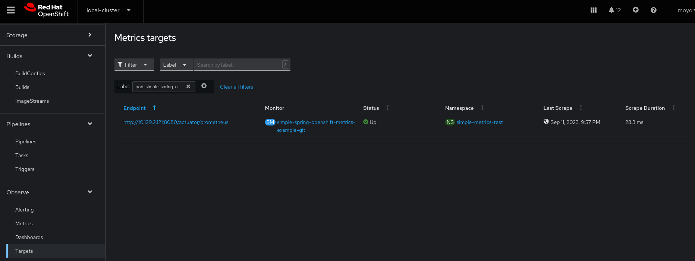
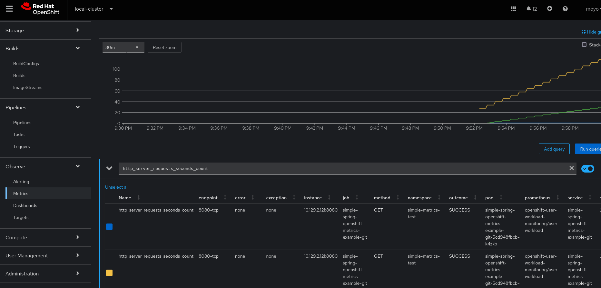

# simple-spring-openshift-metrics-example
Simple Example of using the integrated OpenShift application metrics monitoring with SpringBoot Apps.


## Pre-Requisites
- OCP 4.10+
- [Must enable User Workload Monitoring on Cluster](https://docs.openshift.com/container-platform/4.8/monitoring/enabling-monitoring-for-user-defined-projects.html)
- [If testing alerts, enable platform Alertmanager for user-defined alert routing](https://docs.openshift.com/container-platform/4.14/monitoring/enabling-alert-routing-for-user-defined-projects.html#enabling-the-platform-alertmanager-instance-for-user-defined-alert-routing_enabling-alert-routing-for-user-defined-projects)


## Steps
### Metrics Example
1 Deploy Sample Application 

- Run Deploy Command
    ```bash
    oc apply -k ./deploy
    ```

- Start Image Build

    ```bash
    oc start-build bc/simple-spring-openshift-metrics-example-git -n simple-metrics-test
    ```

2 If using integrated OpenShift Monitorting stack

- Create ServiceMonitor

    ```bash
    oc apply -k ./monitor
    ```

2 Confirm Deployment and Observe

- If everything is up correctly our pod should show up as a target under Observe->Target


- And we can use the OCP console to see the captured application metrics with PromQL under Observe->Metrics


### Alerting Example
We can also our application metrics for alerting

- [Enable Alerting for User Defined Projects](https://docs.openshift.com/container-platform/4.14/monitoring/enabling-alert-routing-for-user-defined-projects.html)

- Create a Prometheus Rule to monitor our Alerts
    ```bash
    oc apply -k ./alert
    ```

- Calling the Application URL more than 5 times should trigger an Alert
```bash
indexroute=$(oc get route simple-spring-openshift-metrics-example-git -n simple-metrics-test -o jsonpath='{.spec.host}')
for i in {1..6};do curl -k  https://$indexroute ;done
```
### Cleanup

```bash
oc delete -k ./deploy
```